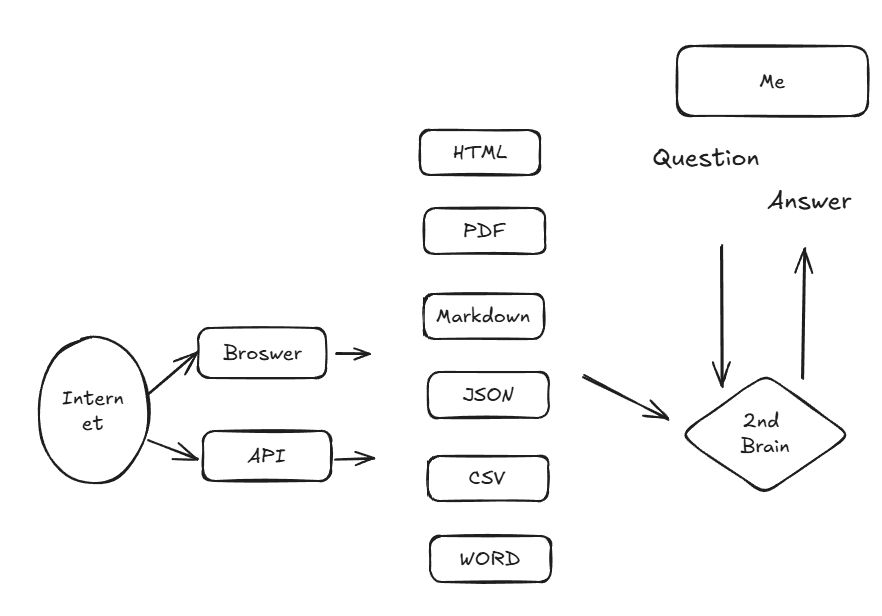

# Second Brain

## Warning: I will flag out when it could be fit for everybody to use with one-click manner. For time being, it's still a toy of IT professionals because it's risky to be used by non-IT people.

## Design

The diagram shows above is an ideal and high level workflow but the key is how to ensure LLM to maximize its capability by using context.

- [version 1](version1/) which is  chatbot to consume PDF inspired by [OpenAI](https://blog.gopenai.com/building-a-rag-chatbot-using-langchain-and-streamlit-engage-with-your-pdfs-9163cec219e1).
- [version 2](version2/) which is a web UI to put two LLM in and human player to manage two AI chat with each other.